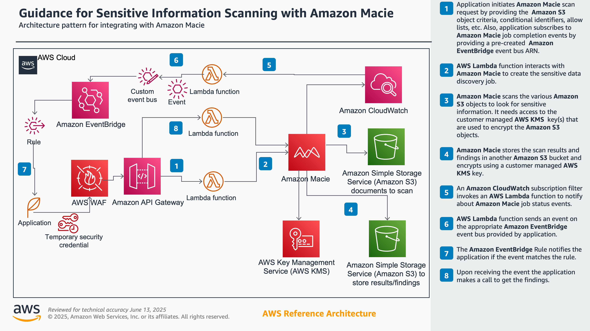

# Guidance for Sensitive Information Scanning with Amazon Macie on AWS

This sample code demonstrates how customer applications can scan artifacts for Personally Identifiable Information (PII), financial information or credentials, and other sensitive information with Amazon Macie.


## Table of Contents

1. [Overview](#overview-required)
    - [Cost](#cost)
2. [Prerequisites](#prerequisites-required)
    - [Operating System](#operating-system-required)
3. [Deployment Steps](#deployment-steps-required)
4. [Deployment Validation](#deployment-validation-required)
5. [Running the Guidance](#running-the-guidance-required)
6. [Next Steps](#next-steps-required)
7. [Cleanup](#cleanup-required)


## Overview 

This guidance  provides organizations with an automated solution for discovering and protecting sensitive data across their AWS environment. While Amazon Macie offers powerful built-in capabilities for sensitive data discovery, organizations often need a more integrated, automated, and customizable approach to manage their data security at scale.

This guidance enables security teams and developers to:

* Automate routine sensitive data discovery across multiple S3 buckets
* Create custom scanning rules and workflows based on organizational requirements
* Receive real-time notifications about sensitive data findings
* Maintain detailed audit trails for compliance purposes
* Integrate sensitive data scanning into existing security workflows
* The architecture leverages serverless AWS services to provide a scalable, cost-effective solution that can be deployed without managing infrastructure. It orchestrates Amazon Macie scans through Lambda functions, manages findings through EventBridge rules, and provides comprehensive monitoring through CloudWatch, all while maintaining security through temporary credentials and KMS encryption.

This guidance demonstrates how organizations can implement automated sensitive data discovery with granular control over scanning parameters, notification workflows, and response actions. It provides developers and security teams with the building blocks needed to create a robust sensitive data management system that meets their specific security and compliance requirements.

## Architecture Diagram



### Cost

You are responsible for the cost of the AWS services used while running this Guidance. As of June 2025, the cost for running this Guidance with the default settings in the US East (N. Virginia) AWS Region is approximately $515.44 per month for processing 500 GB of data stored in S3

We recommend creating a [Budget](https://docs.aws.amazon.com/cost-management/latest/userguide/budgets-managing-costs.html) through [AWS Cost Explorer](https://aws.amazon.com/aws-cost-management/aws-cost-explorer/) to help manage costs. Prices are subject to change. For full details, refer to the pricing webpage for each AWS service used in this Guidance.

The following table provides a sample cost breakdown for deploying this Guidance with the default parameters in the US East (N. Virginia) Region for one month.

| AWS service  | Dimensions | Cost [USD] |
| ----------- | ------------ | ------------ |
|Amazon Macie| Data scanned: 500 GB per month | $499 |
|Amazon API Gateway | 100,000 REST API calls per month  | $0.35  |
|AWS Lambda| 10 custom metrics with detailed monitoring| $3.00 |
| Amazon CloudWatch | 1,000 active users per month without advanced security feature | $0.00 |
| Amazon S3 | 500 GB of data scanned per month stored in S3  | $11.50 |
| Amazon EventBridge | 100,000 events per month | $0.10 |


## Prerequisites

1. Enable Amazon Macie on your account. See [Getting Started](https://docs.aws.amazon.com/macie/latest/user/getting-started.html) with Macie and follow all steps until Step 5. This ensures Macie is configured correctly and the Macie CloudWatch log group is created prior to deploying our stack
2. A recent/LTS version of [node.js](https://nodejs.org/en) installed on your laptop/PC from which you will be deploying this solution
3. An AWS account, and credentials for that account with sufficient permissions to deploy the sample code. See [Onboarding to AWS](https://aws.amazon.com/getting-started/onboarding-to-aws) if you are new to AWS and need to create an account
4. An [Amazon EventBridge](https://aws.amazon.com/eventbridge/) EventBus ARN where the Macie job completion event will be sent and a rule/subscription to listen for that event. You can use the default EventBus for this or create a new one. See [lib/lambda/process-macie-job-status/README.md](source/lib/lambda/process-macie-job-status/README.md#eventbridge-event-structure) for event details. Create an Event rule to receive this event and use your application as the Target. You can also use CloudWatch logs as a target for this rule for testing. The Event pattern you can use for this rule is:

 ```
 {
  "source": ["macie.job.status"]
}
 ```

5. An Amazon S3 bucket containing the objects that you want to scan
6. Your application that invokes the API to kick-off the Amazon Macie Classification job. See **Usage Examples** in [source/API_USAGE.md](source/API_USAGE.md#usage-examples) for sample applications including command line tools that you can use for this

### Operating System 

Can be deployed using Windows, Mac and Linux environments


### aws cdk bootstrap

This Guidance uses aws-cdk. If you are using aws-cdk for first time, please follow the getting started guide to install AWS CDK and bootstrap your environment https://docs.aws.amazon.com/cdk/v2/guide/getting-started.html


## Deployment Steps

1. Clone the repo using command ```git clone git@github.com:aws-solutions-library-samples/guidance-for-sensitive-information-scanning-on-aws.git```
2. cd to the repo source folder ```cd guidance-for-sensitive-information-scanning-on-aws/source```
3. Run the command to bootstrap CDK environment ```npx cdk bootstrap```
4. Run the command to deploy the CDK environment ```npx cdk deploy```


## Deployment Validation

* Open CloudFormation console and verify the status of the stack with the name starting with SolutionsGuidanceMacieStack.
* Once the deployment is successful, you should see 3 outputs in Console - MacieApiUrl, MacieApiId and MacieApiEndpointXXXX


## Running the Guidance

1. Call /create-job API to create a new job
2. Get notified via EventBridge on job completion
3. Call /get-findings API to get findings from the job

See **Usage Examples** in [source/API_USAGE.md](source/API_USAGE.md#usage-examples) for sample applications including command line tools that you can use for this. 

## Cleanup 

Run ```npx cdk destroy``` to remove the stack that you deployed. Note that any Amazon S3 objects created by Amazon Macie will have to be manually cleaned up.


## Notices 

*Customers are responsible for making their own independent assessment of the information in this Guidance. This Guidance: (a) is for informational purposes only, (b) represents AWS current product offerings and practices, which are subject to change without notice, and (c) does not create any commitments or assurances from AWS and its affiliates, suppliers or licensors. AWS products or services are provided “as is” without warranties, representations, or conditions of any kind, whether express or implied. AWS responsibilities and liabilities to its customers are controlled by AWS agreements, and this Guidance is not part of, nor does it modify, any agreement between AWS and its customers.*


## Authors 

Kandha Sankarapandian Snr. Manager, AWS Specialist Prototyping

Prashob Krishnan Principal TAM (US-FSI)
